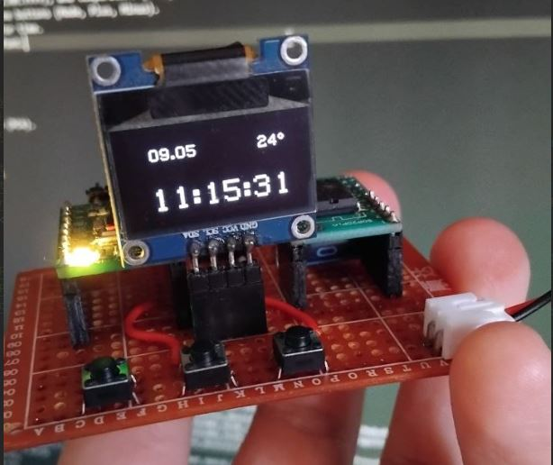

# CH32V003 OLED Clock
A real-time clock using CH32V003 (RISC-V), DS3231 RTC, and SSD1306 OLED display.

## Demo


## Features
- Displays time (HH:MM:SS), date (DD.MM or DD.MM.YYYY), and temperature (TT°C).
- Setup mode for adjusting time/date via three buttons (Mode, Plus, Minus).
- 8x8 font (0-9, ., :, °), scaled to 16x16 for time.
- Size: 5548 bytes with -Os, 104 bytes for font.

## Hardware
- CH32V003: PC1 (SDA), PC2 (SCL) for I2C.
- DS3231 real time clock chip.
- SSD1306 OLED display 128x64.
- Buttons: Mode (PC0), Plus (PC3), Minus (PC4).

## Build
```bash
sudo apt install cmake build-essential
# Install riscv-none-elf-gcc
mkdir build && cd build
cmake ..
make
